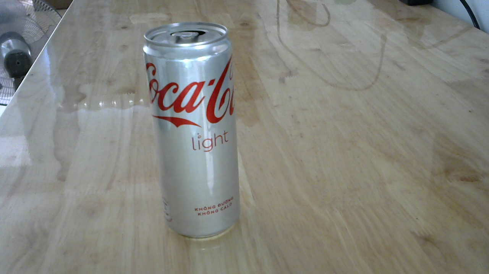
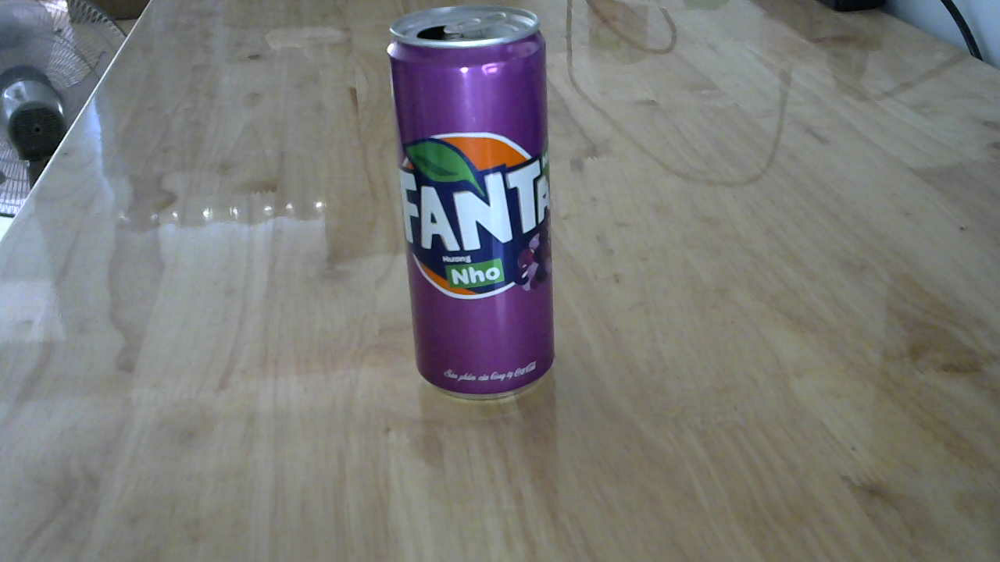
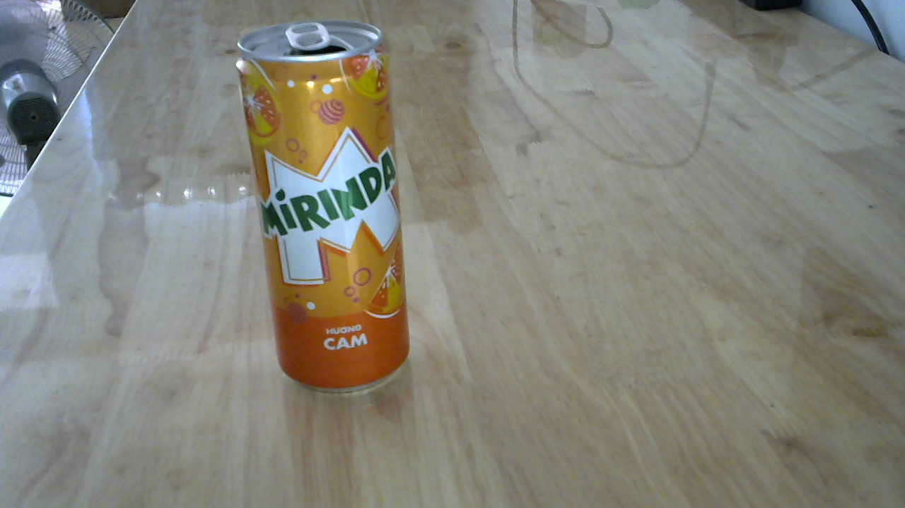
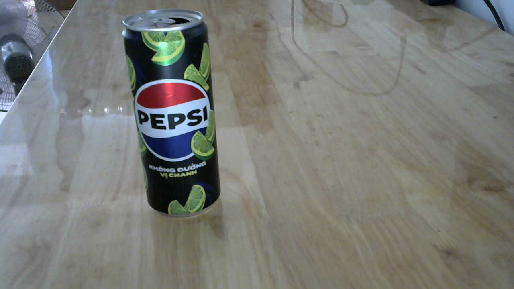
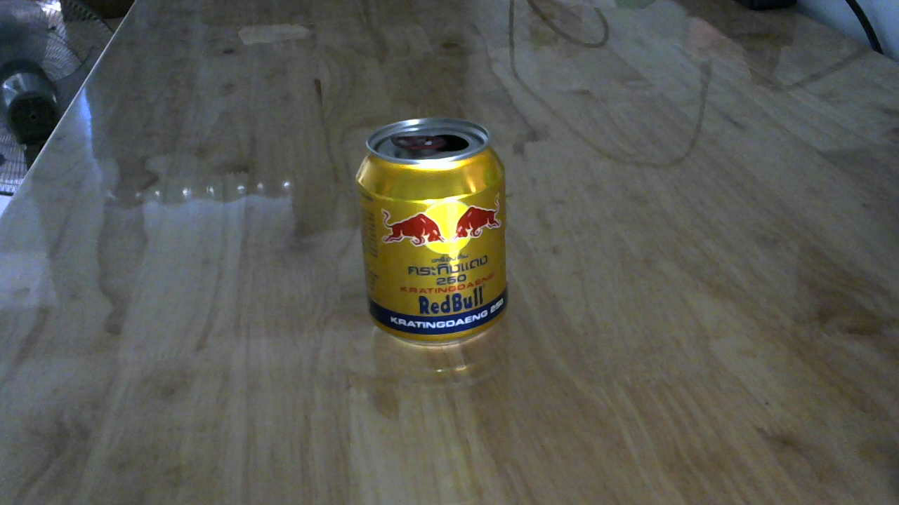
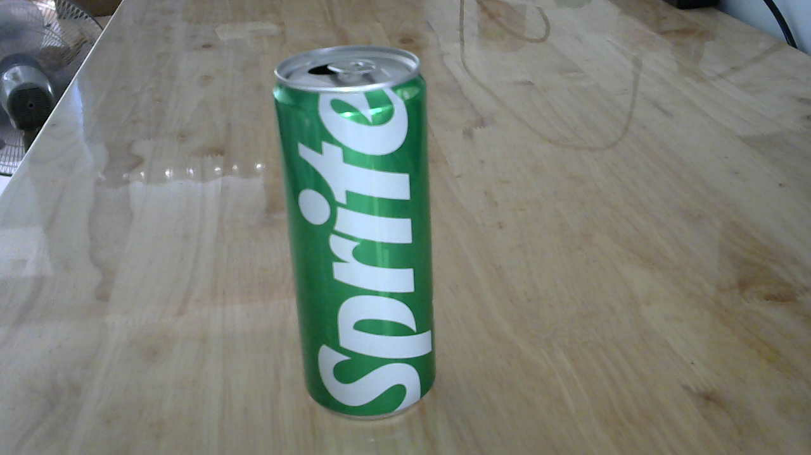
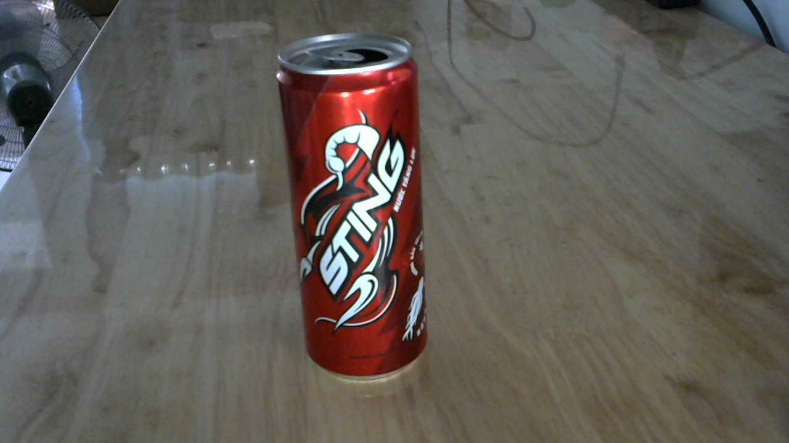

# Trash Classification with Jetson Nano

This repository contains a project demonstrating **trash classification** using the **NVIDIA Jetson Nano**. The main objective is to identify and classify discarded drink cans, to support efficient waste management and recycling initiatives.

**List of drink cans**

***1. Coca Cola***


***2. Fanta***


***3. Mirinda***


***4. Pepsi***


***5. Red Bull***


***6. Sprite***


***7. Sting***


---

## Table of Contents

1. [Introduction](#introduction)  
2. [Features](#features)  
3. [Requirements](#requirements)  
4. [Setup](#setup)  
5. [Using the ONNX Model](#using-the-onnx-model)  
6. [Retraining with your own Data](#retraining-with-your-own-data)  
7. [Video](#video) 

---

## Introduction

The **Trash Classification with Jetson Nano** project is designed to aid in waste classification by leveraging machine learning. The system identifies different brands of drink cans, helping to enhance recycling practices and promote environmental sustainability.

### Objectives:
- Classify used drink cans by brand (e.g., Coca-Cola, Pepsi).  
- Demonstrate real-time object detection on the Jetson Nano.  
- Provide an open-source solution for developers and researchers.  

---

## Features

- **Brand Detection:** Classifies cans of various brands using a trained deep learning model.  
- **Real-time Processing:** Utilizes the Jetson Nano's GPU for real-time inference.  
- **Customizable Dataset:** Easily extendable to include additional classes.  

---

## Requirements
- NVIDIA Jetson Nano Developer Kit  
- USB/CSI Camera  
- MicroSD card (32GB or higher)  
- Power supply for Jetson Nano  
- JetPack SDK (version 4.6 or higher)  
- Python 3.6+  

---

## Setup
   ```bash
   git clone https://github.com/nlhtrung00/trash-classification.git
   cd trash-classification
  ```

---

## Using the ONNX Model

The provided ONNX model is pre-trained to classify common drink cans. You can use it directly for inference by placing the model file (`resnet18.onnx`) in the project directory and running.  

---

## Retraining with your own Data

To retrain the model using new data, follow these steps:  
 
### Step 1: Collect and Label Data  

   - Install and follow the **Hello AI World** example from NVIDIA. Follow the [setup guide](https://github.com/dusty-nv/jetson-inference#prerequisite).
   - Capture images directly from your camera. The images will be saved in the specified output directory.

### Step 2: Retrain the Model 

1. **Start Retraining:**  
   Use the `train.py` script from **Hello AI World** to retrain your model. For example:  
   ```
   python3 train.py --model-dir=models/trash --batch-size=4 --workers=1 --epochs=100 data/trash
   ``` 

2. **Export to ONNX Format:**  
   Once retraining is complete, export the updated model back to ONNX format:  
   ```
   python3 onnx_export.py --model-dir=models/trash
   ```
### Step 3: Test the Retrain Model 
   Test the ONNX model
   ```
   imagenet --model=models/trash/resnet18.onnx --labels=data/trash/labels.txt --input_blob=input_0 --output_blob=output_0 /dev/video0
   ```
## Video

https://github.com/user-attachments/assets/df154d11-080a-4a06-9179-a1adfacaab8a

